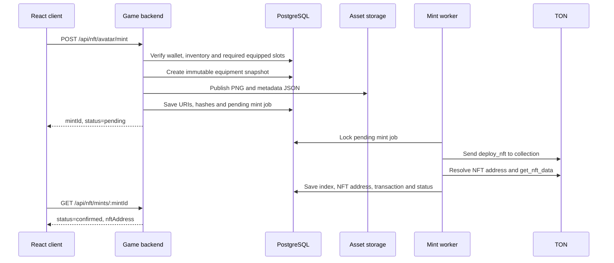

# Архитектура NFT-аватаров в TON

Дата проверки документации: 2026-06-11

## 1. Продуктовая модель

Путь пользователя:

1. Пользователь играет и получает внутреннюю валюту.
2. За внутреннюю валюту он покупает предметы.
3. Купленные предметы хранятся в игровом инвентаре.
4. Пользователь выбирает по одному предмету для каждого слота:
   - `background`;
   - `eyes`;
   - `cloth`;
   - `hat`.
   Дополнительно пользователь может экипировать один `weapon`.
5. На главном экране игра собирает итоговый образ из экипированных слоёв.
6. По команде `MINT AVATAR` backend фиксирует текущую экипировку.
7. Backend создаёт итоговое PNG-изображение.
8. Изображение и атрибуты публикуются как неизменяемые metadata.
9. В TON минтится один NFT-аватар, принадлежащий кошельку пользователя.

Отдельные предметы не являются NFT. Они существуют внутри игры и становятся
атрибутами NFT только в момент создания аватара.

Сам NFT является снимком собранного персонажа:

- картинка NFT совпадает с образом на главном экране;
- атрибуты NFT описывают экипированные предметы;
- один NFT содержит ровно по одному `background`, `eyes`, `cloth` и `hat`;
- `weapon` добавляется в NFT только если он экипирован;
- изменение экипировки после минта не меняет уже созданный NFT.

## 2. Коллекция TON

Для первой версии нужна одна коллекция:

```text
Tamagotchi Avatars
```

Каждый NFT item в этой коллекции представляет один законченный образ
персонажа.

TON NFT работает по TEP-62:

- коллекция является отдельным смарт-контрактом;
- каждый NFT является отдельным смарт-контрактом;
- коллекция выпускает NFT items;
- принадлежность NFT коллекции проверяется через саму коллекцию;
- metadata оформляются по TEP-64.

Для 10 000 аватаров в сети будет 10 001 контракт: один контракт коллекции и
10 000 контрактов NFT items.

Коллекция должна предоставлять:

- `get_collection_data()`;
- `get_nft_address_by_index(index)`;
- `get_nft_content(index, individual_content)`.

NFT item должен предоставлять `get_nft_data()` и поддерживать стандартный
TEP-62 transfer.

Стандарт TEP-62 не определяет команду минта. Официальный reference contract
использует:

```text
deploy_nft#00000001
query_id:uint64
item_index:uint64
amount:Coins
content:^Cell
= InternalMsgBody;
```

Opcode `1` является интерфейсом reference implementation, а не обязательной
частью TEP-62. Backend должен формировать payload под конкретный контракт
коллекции, который будет задеплоен проектом.

## 3. NFT как неизменяемый снимок

Минт должен фиксировать состояние экипировки в конкретный момент времени.

Например, пользователь экипировал:

```text
background = Neon City
weapon     = Plasma Sword
eyes       = Red Eyes
cloth      = Cyber Jacket
hat        = Crown
```

Именно эти пять предметов становятся атрибутами нового NFT. Если после минта
пользователь наденет другую шапку, старый NFT останется с `Crown`.

Это даёт понятную модель:

- игровой инвентарь и экипировка являются изменяемым состоянием;
- NFT является неизменяемым результатом выбранной сборки;
- новый вариант сборки требует нового минта.

Не следует делать metadata URL, который каждый раз возвращает текущую
экипировку пользователя. Такой NFT визуально менялся бы после минта, зависел
бы от доступности игрового backend и мог бы отображаться по-разному из-за
кеширования в кошельках и маркетплейсах.

## 4. Каноническая сборка изображения

В проекте уже существует backend-сервис:

```text
tamagotchi-back/src/services/avatar.service.js
```

Он:

- получает `user_equipped`;
- находит файлы предметов;
- передаёт их worker-потоку;
- собирает прозрачные PNG-слои через Jimp;
- возвращает итоговое PNG 3000x3000.

Текущий канонический порядок backend:

```text
background
weapon
eyes
cloth
hat
```

Этот порядок должен использоваться:

- на главном экране React;
- при preview перед минтом;
- при создании NFT PNG;
- при повторной проверке результата.

Для минта обязательны четыре слоя: `background`, `eyes`, `cloth` и `hat`.
`weapon` является опциональным слоем. Если обязательный слот не заполнен,
предмет не найден или файл выбранного слоя отсутствует, backend должен
отклонить минт.
Нельзя создавать NFT с частично собранным или незаметно пропущенным слоем.

Текущий `avatar.worker.js` при отсутствующем файле пишет warning и продолжает
сборку. Для NFT renderer нужен строгий режим, в котором такая ситуация
завершается ошибкой до публикации PNG и metadata. Отсутствие экипированного
`weapon` при этом является допустимым состоянием, а не отсутствующим файлом.

Сейчас в React mini app порядок `cloth` и `eyes` отличается от backend. Для
продуктовой версии это нужно устранить.

Самый надёжный вариант: главный экран показывает preview, полученный от того
же backend renderer, который создаёт NFT. Тогда preview и NFT гарантированно
собираются одним кодом.

Рекомендуемые endpoints:

```text
GET  /api/avatar/preview
POST /api/nft/avatar/mint
GET  /api/nft/mints/:mintId
```

`GET /api/avatar/preview` должен возвращать PNG текущей экипировки без
долгосрочного кеширования.

При минте нельзя повторно читать экипировку на разных этапах. Backend сначала
создаёт snapshot, а затем все последующие операции используют только его.
Иначе пользователь может сменить предмет между генерацией metadata и
изображения.

## 5. Snapshot экипировки

Snapshot должен содержать не только ID предметов, но и данные, отображаемые в
NFT metadata:

```json
{
  "background": {
    "item_id": 143,
    "name": "Neon City",
    "rarity": "rare",
    "model_name": "background_143.png"
  },
  "weapon": {
    "item_id": 205,
    "name": "Plasma Sword",
    "rarity": "epic",
    "model_name": "weapon_205.png"
  },
  "eyes": {
    "item_id": 84,
    "name": "Red Eyes",
    "rarity": "uncommon",
    "model_name": "eyes_84.png"
  },
  "cloth": {
    "item_id": 70,
    "name": "Cyber Jacket",
    "rarity": "rare",
    "model_name": "cloth_70.png"
  },
  "hat": {
    "item_id": 97,
    "name": "Crown",
    "rarity": "legendary",
    "model_name": "hat_97.png"
  }
}
```

Backend обязан проверить:

- каждый предмет существует;
- тип предмета соответствует слоту;
- пользователь владеет предметом;
- заполнены четыре обязательных слота: `background`, `eyes`, `cloth`, `hat`;
- `weapon` отсутствует либо содержит ровно один предмет типа `weapon`;
- в каждом обязательном слоте находится ровно один предмет соответствующего
  типа;
- существуют и успешно читаются файлы всех выбранных слоёв;
- snapshot сформирован из данных PostgreSQL, а не из переданного клиентом
  списка атрибутов.

React-клиент отправляет только запрос на минт. Клиент не должен самостоятельно
задавать `item_id`, названия, rarity, image URL, NFT index или адрес
получателя.

## 6. Metadata NFT

Для первой версии рекомендуется TEP-64 off-chain metadata:

- контракт коллекции хранит общий HTTPS-префикс;
- NFT item хранит индивидуальный ключ, например `avatars/42.json`;
- `get_nft_content()` возвращает полный URL metadata.

Metadata коллекции:

```json
{
  "name": "Tamagotchi Avatars",
  "description": "Player-created avatars assembled from in-game items",
  "image": "https://assets.example.com/nft/collection.png",
  "social_links": [
    "https://game.example.com"
  ]
}
```

Metadata NFT:

```json
{
  "name": "Shao #42",
  "description": "A Tamagotchi avatar created from the player's equipped items",
  "image": "https://assets.example.com/nft/avatars/42.png",
  "attributes": [
    {
      "trait_type": "Background",
      "value": "Neon City"
    },
    {
      "trait_type": "Weapon",
      "value": "Plasma Sword"
    },
    {
      "trait_type": "Eyes",
      "value": "Red Eyes"
    },
    {
      "trait_type": "Cloth",
      "value": "Cyber Jacket"
    },
    {
      "trait_type": "Hat",
      "value": "Crown"
    }
  ],
  "game": {
    "schema_version": 1,
    "snapshot_id": "123",
    "items": {
      "background": 143,
      "weapon": 205,
      "eyes": 84,
      "cloth": 70,
      "hat": 97
    }
  }
}
```

В стандартный `attributes` следует помещать понятные пользователю названия.
Технические ID можно хранить в дополнительном объекте `game`.

Пустые обязательные слоты в metadata не допускаются: endpoint минта должен
потребовать заполненные `background`, `eyes`, `cloth` и `hat`. Если оружие не
экипировано, attribute `Weapon` не добавляется, а `game.items.weapon` имеет
значение `null`.

TEP-64 стандартизует способ хранения metadata и общие поля. Формат
`trait_type`/`value` является распространённой marketplace-конвенцией, поэтому
его отображение необходимо проверить на testnet в целевых кошельках и
маркетплейсах.

## 7. Неизменяемое хранение

До отправки mint-транзакции backend должен:

1. Создать snapshot экипировки.
2. Собрать PNG из snapshot.
3. Сформировать JSON metadata.
4. Опубликовать PNG и JSON.
5. Зафиксировать их URI и SHA-256 hashes в PostgreSQL.
6. Только после этого отправить mint в TON.

Публикация должна быть неизменяемой. Подходящие варианты:

- object storage с versioning и запретом overwrite;
- IPFS;
- Arweave;
- content-addressed storage с публичным HTTPS gateway.

Нельзя использовать существующий динамический endpoint
`/api/avatar/download` как NFT image URL: он требует авторизацию, меняется
вместе с экипировкой и не является публичным постоянным ресурсом.

## 8. Когда происходит минт

Покупка предмета и минт NFT являются разными действиями.

Покупка:

```text
BEANZ -> предмет в inventory
```

Экипировка:

```text
inventory -> один выбранный предмет на слот
```

Минт:

```text
текущая экипировка -> snapshot -> PNG + metadata -> NFT
```

Таким образом, `/api/shop/buy` не должен автоматически создавать NFT. Минт
запускается отдельной кнопкой после того, как пользователь собрал желаемый
образ.

## 9. Политика повторного использования предметов

Нужно явно зафиксировать продуктовое правило: можно ли использовать один и тот
же купленный предмет в нескольких NFT.

### Рекомендуемая базовая модель: предметы не расходуются

- предмет остаётся в игровом инвентаре;
- пользователь продолжает использовать его в игре;
- один предмет может войти в несколько NFT-снимков;
- ценность NFT определяется всей комбинацией и моментом создания.

Это наиболее простой и понятный вариант для игрового аватара.

### Альтернатива: предметы блокируются или расходуются

Если supply предметов должен ограничивать количество NFT с этим trait:

- выбранные копии блокируются при создании mint job;
- после подтверждения минта они расходуются или навсегда привязываются к NFT;
- при окончательной ошибке минта блокировка снимается.

Текущая таблица `inventory` хранит количество по `(user_id, item_id)`, поэтому
для постоянной привязки конкретных копий потребуются отдельные экземпляры
предметов. Это значительно усложняет inventory и marketplace.

До отдельного продуктового решения документ далее предполагает, что предметы
не расходуются.

## 10. Асинхронный mint pipeline

TON является асинхронным blockchain. Нельзя держать PostgreSQL-транзакцию
открытой, ожидая подтверждения сети.



Подробный flow:

1. Пользователь подключает TON-кошелёк.
2. Backend подтверждает владение кошельком через `ton_proof`.
3. Пользователь нажимает `MINT AVATAR`.
4. Backend читает `user_equipped` с блокировкой от конкурентного изменения.
5. Backend проверяет четыре обязательных слота, опциональное оружие и владение
   всеми выбранными предметами.
6. Backend создаёт immutable snapshot.
7. Backend генерирует PNG только из snapshot.
8. Backend публикует PNG и metadata JSON.
9. Backend создаёт идемпотентный mint job.
10. Worker получает следующий `item_index` коллекции.
11. Worker формирует payload reference collection:
    - opcode `1`;
    - `query_id`;
    - `item_index`;
    - TON для нового item contract;
    - адрес кошелька пользователя;
    - индивидуальный metadata key.
12. Mint authority отправляет сообщение в collection contract.
13. Worker ждёт выполнения транзакции.
14. Worker вызывает `get_nft_address_by_index(index)`.
15. Worker вызывает `get_nft_data()` нового NFT.
16. Worker проверяет:
    - NFT инициализирован;
    - адрес коллекции правильный;
    - owner равен кошельку пользователя;
    - individual content соответствует snapshot.
17. Job получает статус `confirmed`.

Принятый RPC message или полученный BoC ещё не означает успешный минт.
Сообщение может завершиться ошибкой или bounce. Статус `confirmed` ставится
только после on-chain проверки.

## 11. Защита от двойного минта

React может повторить запрос из-за double-click, timeout или retry. Для
идемпотентности клиент должен передавать случайный `requestId`, а backend
создавать не более одного mint job на:

```text
(user_id, request_id)
```

Также полезно вычислять hash snapshot:

```text
sha256(background_id, weapon_id, eyes_id, cloth_id, hat_id)
```

Если оружие не экипировано, `weapon_id` при сериализации snapshot имеет
каноническое значение `null`.

Snapshot hash не обязан быть уникальным: пользователь может сознательно
создать несколько NFT с одинаковым образом. Но повтор одного и того же
`requestId` не должен создавать новый NFT.

## 12. Изменения PostgreSQL

Существующие таблицы `items`, `inventory` и `user_equipped` подходят для
игровых предметов. Отдельные экземпляры каждого предмета не нужны, пока
предметы не расходуются при минте.

Нужно добавить snapshot и mint job:

```sql
CREATE TABLE nft_avatar_snapshots (
  id BIGSERIAL PRIMARY KEY,
  user_id BIGINT NOT NULL REFERENCES users(id) ON DELETE RESTRICT,
  request_id UUID NOT NULL,
  recipient_wallet_address TEXT NOT NULL,

  background_item_id BIGINT REFERENCES items(id),
  weapon_item_id BIGINT REFERENCES items(id),
  eyes_item_id BIGINT REFERENCES items(id),
  cloth_item_id BIGINT REFERENCES items(id),
  hat_item_id BIGINT REFERENCES items(id),

  attributes_json JSONB NOT NULL,
  snapshot_sha256 TEXT NOT NULL,
  image_uri TEXT,
  image_sha256 TEXT,
  metadata_uri TEXT,
  metadata_sha256 TEXT,

  created_at TIMESTAMPTZ NOT NULL DEFAULT NOW(),
  UNIQUE (user_id, request_id)
);

CREATE TABLE nft_mints (
  id BIGSERIAL PRIMARY KEY,
  snapshot_id BIGINT NOT NULL UNIQUE
    REFERENCES nft_avatar_snapshots(id) ON DELETE RESTRICT,
  network TEXT NOT NULL CHECK (network IN ('testnet', 'mainnet')),
  collection_address TEXT NOT NULL,
  recipient_wallet_address TEXT NOT NULL,
  query_id NUMERIC(20, 0) NOT NULL UNIQUE,
  item_index NUMERIC(78, 0),
  nft_address TEXT UNIQUE,
  tx_hash TEXT,
  status TEXT NOT NULL DEFAULT 'pending'
    CHECK (
      status IN (
        'preparing',
        'pending',
        'submitting',
        'submitted',
        'confirmed',
        'failed'
      )
    ),
  attempts INTEGER NOT NULL DEFAULT 0,
  last_error TEXT,
  submitted_at TIMESTAMPTZ,
  confirmed_at TIMESTAMPTZ,
  created_at TIMESTAMPTZ NOT NULL DEFAULT NOW(),
  updated_at TIMESTAMPTZ NOT NULL DEFAULT NOW()
);
```

`attributes_json` должен содержать полные snapshot-данные предметов, а не
только ссылки на изменяемые строки `items`. Если администратор позже
переименует предмет, metadata уже созданного NFT не должны измениться.

## 13. Backend API

TON Connect:

```text
POST   /api/tonconnect/nonce
POST   /api/tonconnect/verify
GET    /api/ton/wallet/me
DELETE /api/ton/wallet/me
```

Avatar NFT:

```text
GET  /api/avatar/preview
POST /api/nft/avatar/mint
GET  /api/nft/mints/:mintId
GET  /api/nft/avatars/me
```

Запрос:

```json
{
  "requestId": "bb87dc26-d442-45ac-a4ef-2a048afdd862"
}
```

Ответ на создание:

```json
{
  "ok": true,
  "mintId": "51",
  "snapshotId": "123",
  "status": "pending",
  "previewUrl": "https://assets.example.com/nft/avatars/pending/123.png"
}
```

Ответ после подтверждения:

```json
{
  "mintId": "51",
  "status": "confirmed",
  "network": "testnet",
  "itemIndex": "42",
  "nftAddress": "EQ...",
  "metadataUrl": "https://assets.example.com/nft/avatars/42.json"
}
```

## 14. React и TON Connect

Для будущего React-клиента используется официальный пакет:

```bash
npm i @tonconnect/ui-react
```

Публичный HTTPS manifest:

```json
{
  "url": "https://game.example.com",
  "name": "Tamagotchi",
  "iconUrl": "https://game.example.com/icon-180.png",
  "termsOfUseUrl": "https://game.example.com/terms",
  "privacyPolicyUrl": "https://game.example.com/privacy"
}
```

Provider:

```tsx
import { TonConnectUIProvider } from '@tonconnect/ui-react';

export function App() {
  return (
    <TonConnectUIProvider
      manifestUrl="https://game.example.com/tonconnect-manifest.json"
    >
      <Game />
    </TonConnectUIProvider>
  );
}
```

Для UI используются:

- `TonConnectButton`;
- `useTonWallet`;
- `useTonAddress`;
- `useIsConnectionRestored`.

В текущем React mini app основа интеграции находится в:

```text
tamagotchi-miniapp/src/ton/TonConnectProvider.tsx
tamagotchi-back/src/routes/ton.routes.js
tamagotchi-back/src/services/ton-proof.service.js
```

На главном экране используется официальный `TonConnectButton`. Backend
выпускает одноразовый challenge, проверяет domain, timestamp, network,
StateInit, адрес, public key и Ed25519 signature, после чего сохраняет
подтверждённый адрес пользователя.

Подключение кошелька само по себе не доказывает владение адресом. Перед
привязкой кошелька и минтом backend должен проверить `ton_proof`:

- `walletStateInit` действительно создаёт заявленный адрес;
- Ed25519 signature корректна;
- domain точно совпадает с доменом приложения;
- timestamp находится в допустимом окне;
- nonce был выпущен backend и используется один раз.

React-клиент не подписывает mint-транзакцию в рекомендуемой модели. Он:

1. подключает кошелёк;
2. проходит `ton_proof`;
3. показывает канонический preview;
4. вызывает endpoint минта;
5. отображает `preparing`, `pending`, `submitted`, `confirmed` или `failed`.

## 15. Кто платит и подписывает минт

Для MVP рекомендуется backend service wallet:

- кошелёк является разрешённым minter/owner коллекции;
- worker подписывает mint transaction;
- проект оплачивает gas;
- пользователь получает NFT без необходимости отдельно платить TON.

Риски:

- компрометация hot wallet позволяет выпускать NFT;
- retries могут создать дубликаты;
- service wallet необходимо пополнять;
- требуется корректная работа с wallet `seqno`.

Для production:

- административный owner коллекции должен быть multisig;
- mint authority должен быть отдельным ограниченным кошельком или minter
  contract;
- секрет нельзя хранить в React, репозитории или обычной `.env` на публичном
  сервере;
- нужны мониторинг баланса, лимиты, audit log и reconciliation worker.

## 16. Передача NFT

После минта NFT принадлежит TON-кошельку пользователя и может быть передан
через стандартный TEP-62 transfer.

Перед отображением NFT как официального необходимо проверить:

1. Прочитать `index` и `collection_address` через `get_nft_data()`.
2. Вызвать у официальной коллекции `get_nft_address_by_index(index)`.
3. Сравнить полученный адрес с адресом NFT.

Одного заявленного `collection_address` внутри NFT недостаточно: поддельный
контракт может указать адрес любой коллекции.

Передача NFT не передаёт игровые предметы из PostgreSQL. NFT содержит
неизменяемый снимок образа, а не право управлять исходным inventory прежнего
пользователя.

## 17. Этапы реализации

### Этап 1. Testnet

- Добавить React TON Connect.
- Реализовать `ton_proof`.
- Добавить snapshot и mint job таблицы.
- Сделать backend renderer каноническим.
- Реализовать публичное неизменяемое хранение PNG и JSON.
- Задеплоить одну testnet-коллекцию `Tamagotchi Avatars`.
- Реализовать mint worker.
- Проверять каждый NFT через get-methods.

### Этап 2. Игровой flow

- Отделить покупку предмета от минта.
- Показывать preview текущей экипировки.
- Добавить подтверждение snapshot перед минтом.
- Отображать статусы минта и ссылку на explorer.
- Добавить список созданных пользователем NFT.

### Этап 3. Production

- Проверить metadata в целевых кошельках и маркетплейсах.
- Провести аудит collection/minter contract.
- Перенести owner в multisig.
- Защитить mint key.
- Добавить RPC failover и повторную сверку pending transactions.
- Определить лимиты минта и политику одинаковых snapshot.
- Определить royalty policy.

## 18. Официальные источники

- TON NFT overview:
  https://docs.ton.org/blockchain-basics/standard/tokens/nft/overview
- How TON NFT works:
  https://docs.ton.org/blockchain-basics/standard/tokens/nft/how-it-works
- Deploy an NFT item:
  https://docs.ton.org/blockchain-basics/standard/tokens/nft/deploy
- NFT metadata:
  https://docs.ton.org/blockchain-basics/standard/tokens/metadata
- Verify an NFT item:
  https://docs.ton.org/blockchain-basics/standard/tokens/nft/verify
- NFT reference implementation:
  https://docs.ton.org/blockchain-basics/standard/tokens/nft/nft-reference
- TEP-62:
  https://github.com/ton-blockchain/TEPs/blob/master/text/0062-nft-standard.md
- TEP-64:
  https://github.com/ton-blockchain/TEPs/blob/master/text/0064-token-data-standard.md
- Official reference contracts:
  https://github.com/ton-blockchain/token-contract/tree/main/nft
- TON Connect for React:
  https://docs.ton.org/applications/ton-connect/get-started
- TON Connect wallet authentication:
  https://docs.ton.org/applications/ton-connect/how-to/connect
- TON Connect transactions:
  https://docs.ton.org/applications/ton-connect/how-to/send-transaction
